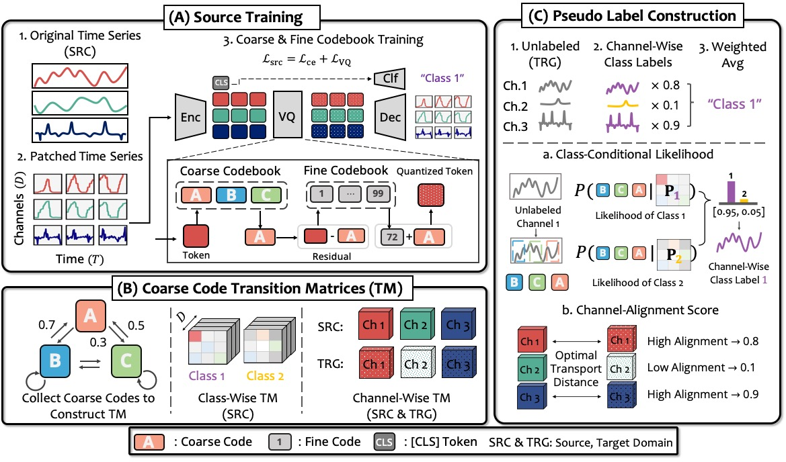

# TransPL: VQ-Code Transition Matrices for Pseudo-Labeling of Time Series Unsupervised Domain Adaptation (ICML'25)


## Explanation of Overview Figure

Overall scheme of TransPL. (A) Source Training: We first train the whole model architecture, i.e., encoder, decoder, two VQ codebooks (coarse and fine codebook), and classifier, using the labeled source domain data. (B) Coarse Code Transition Matrices (TM): The trained encoder and coarse codebook infer coarse codes from both target (unlabeled) and source (labeled) domains. These codes serve as states for constructing class-wise TM (from source) and channel-wise TM (from both domains). (C) Pseudo Label Construction: For unlabeled target data, we compute class-conditional likelihoods per channel using class-wise TM to obtain channel-wise class labels. These are weighted by the similarity between source and target channel-wise TMs, then averaged to generate final pseudo labels.


## GPU Info
- GPU: NVIDIA RTX A6000 (48GB)
- CUDA: 12.1
- Pytorch: 2.0.1
- Pytorch-Lightning: 2.1.2
- Python: 3.10

## Environment Setup
```sh
conda create -n transpl python=3.10
conda activate transpl
pip install -r requirements.txt # install pytorch, pytorch-lightning, torchmetrics, tqdm, pandas, matplotlib, etc.
conda install -c pytorch faiss-gpu==1.8.0 # install faiss-gpu
```

## Minimal Example to Reproduce the Results
Here, we provide a minimal example to show how to use TransPL with the UCIHAR dataset.
We have already uploaded the data (domain 2, 6, 11, 23) and the model to this repository. You will be able to run the following command to reproduce the results. 
```sh
cd DA 
sh da_scripts/ucihar/run_main.sh
```

## Full Dataset Download.
We have uploaded the pre-processed datasets for UCIHAR, WISDM, HHAR, PTB for this code base in the below link. Download them and save them under `src/data/{DATA_NAME}/`

[Download](https://drive.google.com/drive/folders/10GKjHz_PWkMl2Fbqu9TCY0FdlyJGKcFQ?usp=sharing)

## Full Example
```sh 
# 1. UCIHAR
cd DA 
sh da_scripts/ucihar/run_main.sh

# 2. WISDM
sh da_scripts/wisdm/run_main.sh

# 3. HHAR
sh da_scripts/hhar/run_main.sh

# 4. PTB
sh da_scripts/ptb/run_main.sh
```